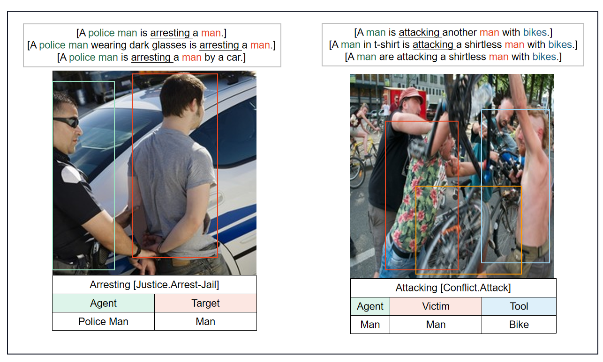

**events.json:**  All multimodal event types

**arguments.json**: All arguments roles.

**meed.json**: Then whole dataset.


The images can be download at Baidu Netdisk : https://pan.baidu.com/s/1YC72EQVlk6xw9DkAgVoBzw  code: zrxq


The **format** of the data:

```json
{
	"image_id": int,
	"image_name": str,
	"text": [str,str,str],
	"event": str,
	"trigger":{
		"word":str,
		"position":[{"start":int,"end":int},{"start":int,"end":int},{"start":int,"end":int}]
	}
	"arguments":[
		"role":
            {
                "word":str,
                "position":[
                    {"start":int,"end":int},
                    {"start":int,"end":int},
                    {"start":int,"end":int}
                ],
                "bbox":[x1,y1,x2,y2]
            }
	]
}
```


There are two example of dataset presented in the paper:

<<<<<<< HEAD

=======

>>>>>>> 63804f391305d1424bf45bd532f2edde69d8c952


